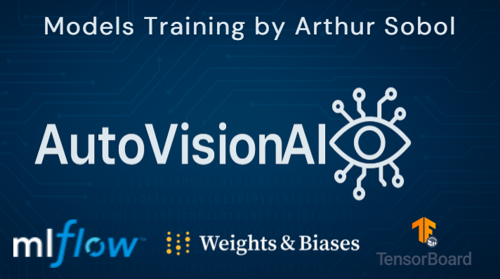
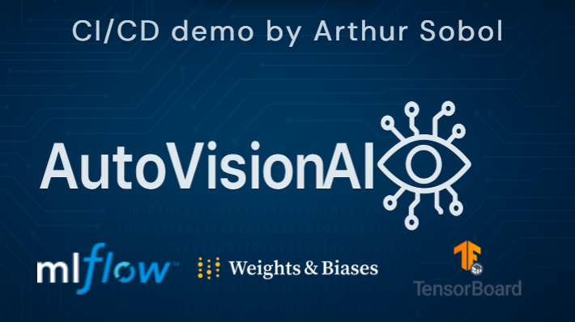

# AutoVisionAI

**Enterprise-Grade Computer Vision Platform for Vehicle Segmentation**

AutoVisionAI is a production-ready, full-stack computer vision platform that delivers end-to-end vehicle segmentation capabilities through state-of-the-art deep learning models. Built with enterprise scalability in mind, it features a comprehensive web interface, cloud-native deployment architecture, and industrial-strength MLOps practices.

## Table of Contents

- [Features](#features)
- [Architecture](#architecture)
- [Video Demonstrations](#video-demonstrations)
- [Supported Models](#supported-models)
- [Quick Start](#quick-start)
- [Web Interface](#web-interface)
- [API Documentation](#api-documentation)
- [Cloud Deployment](#cloud-deployment)
- [MLOps & Experiment Tracking](#mlops--experiment-tracking)
- [Development](#development)
- [Performance](#performance)
- [Contributing](#contributing)

## Features

### Core Capabilities
- **Three Model Architectures**: U-Net, Fast-SCNN, and Mask R-CNN implementations
- **Full-Stack Web Interface**: Modern Streamlit-based UI with real-time training monitoring
- **Production API**: FastAPI-based REST service with comprehensive endpoints
- **Cloud-Native Deployment**: Complete AWS infrastructure with Terraform IaC
- **Enterprise Logging**: Multi-platform experiment tracking (TensorBoard, MLflow, Weights & Biases)
- **Real-Time Training**: WebSocket-powered live training progress monitoring
- **Docker Containerization**: Multi-stage builds optimized for production deployment

### Enterprise Features
- **Infrastructure as Code**: Complete Terraform AWS deployment with auto-scaling
- **Cost-Optimized Architecture**: ~$171/month AWS deployment with detailed cost analysis
- **CI/CD Pipelines**: Automated testing, building, and deployment workflows
- **Health Monitoring**: Comprehensive health checks and monitoring across all services
- **Security**: IAM roles, secrets management, and secure network configuration
- **Scalability**: Auto-scaling ECS services with Application Load Balancer

## Architecture

### System Overview

```
┌─────────────────┐    ┌─────────────────┐    ┌─────────────────┐
│   Streamlit UI  │────│   FastAPI Core  │────│  PyTorch Models │
│   Port 8501     │    │   Port 8000     │    │                 │
└─────────────────┘    └─────────────────┘    └─────────────────┘
         │                       │                       │
         │              ┌─────────────────┐              │
         └──────────────│  EFS Storage    │──────────────┘
                        │  (Experiments)  │
                        └─────────────────┘
                                 │
         ┌─────────────────┬─────────────────┬─────────────────┐
         │                 │                 │                 │
┌─────────────────┐ ┌─────────────────┐ ┌─────────────────┐ ┌─────────────────┐
│   TensorBoard   │ │     MLflow      │ │   Weights &     │ │   CloudWatch    │
│   Port 6006     │ │   Port 8080     │ │    Biases       │ │    Logging      │
└─────────────────┘ └─────────────────┘ └─────────────────┘ └─────────────────┘
```

### Technology Stack

- **Backend**: FastAPI, PyTorch Lightning, Python 3.12+
- **Frontend**: Streamlit with real-time WebSocket communication
- **ML Frameworks**: PyTorch, TorchVision, TorchMetrics
- **Infrastructure**: AWS ECS Fargate, ALB, EFS, S3, CloudWatch
- **Orchestration**: Terraform, Docker, GitHub Actions
- **Monitoring**: TensorBoard, MLflow, Weights & Biases
- **Development**: UV, Ruff, Pre-commit, Pytest

## Video Demonstrations

### Training & Local Development

<div align="center">

[](https://www.youtube.com/watch?v=BPGLiGWIKPc)

*Click to watch the training demonstration video*

</div>

**Features Demonstrated:**
- Local development workflow and training pipeline
- Real-time training progress monitoring
- Model comparison and evaluation
- Experiment tracking integration

### Production Deployment & CI/CD

<div align="center">

[](https://www.youtube.com/watch?v=84aH1zWmyME)

*Click to watch the CI/CD and inference demonstration video*

</div>

**Features Demonstrated:**
- Complete CI/CD pipeline execution
- AWS cloud deployment process
- Production inference capabilities
- Infrastructure monitoring and scaling

## Supported Models

### 1. U-Net (Semantic Segmentation)
- **Architecture**: Encoder-decoder with skip connections
- **Parameters**: ~31M parameters
- **Use Case**: High-accuracy semantic segmentation
- **Implementation**: Built from scratch following the original paper
- **Paper**: [U-Net: Convolutional Networks for Biomedical Image Segmentation](https://arxiv.org/abs/1505.04597)

### 2. Fast-SCNN (Real-Time Segmentation)
- **Architecture**: Lightweight CNN for mobile deployment
- **Parameters**: ~1.1M parameters
- **Use Case**: Real-time inference on edge devices
- **Implementation**: Complete from-scratch implementation
- **Paper**: [Fast-SCNN: Fast Semantic Segmentation Network](https://arxiv.org/abs/1902.04502)

### 3. Mask R-CNN (Instance Segmentation)
- **Architecture**: ResNet50-FPN backbone with custom heads
- **Parameters**: ~44M parameters
- **Use Case**: Instance-level vehicle detection and segmentation
- **Implementation**: TorchVision pretrained backbone with custom predictors
- **Paper**: [Mask R-CNN](https://arxiv.org/abs/1703.06870)

## Quick Start

### Local Development

```bash
# Clone the repository
git clone https://github.com/huginnm/auto-vision-ai.git
cd AutoVisionAI

# Install dependencies with UV (recommended)
curl -LsSf https://astral.sh/uv/install.sh | sh
uv pip install -e ".[all]"
uv run pre-commit install

# Start the full stack locally
make build-local
docker-compose up
```

Access the services:
- **Web Interface**: http://localhost:8501
- **API Documentation**: http://localhost:8000/docs
- **MLflow**: http://localhost:8080
- **TensorBoard**: http://localhost:6006

### Cloud Deployment

```bash
# Complete AWS deployment
make deploy-full

# Or step-by-step
make setup-backend    # Setup Terraform S3 backend
make deploy-infra     # Deploy infrastructure
make push-secrets     # Upload secrets to AWS
make build-push       # Build and push Docker images
make deploy-services  # Deploy application services
```

## Web Interface

### Streamlit Application

The web interface provides an intuitive platform for both inference and training:

#### 👋 Welcome Page
- **Project Overview**: Comprehensive introduction to AutoVisionAI capabilities
- **Quick Start Guide**: Step-by-step instructions for running inference and training
- **API Setup**: Configuration instructions and endpoint documentation
- **System Status**: Real-time health checks for all API endpoints
- **Documentation Links**: Direct access to project resources and support
- **Interactive Tutorials**: Guided workflows for new users

#### 🔍 Inference Page
- **Multi-Input Support**: File upload or URL-based image input
- **Model Selection**: Choose between U-Net, Fast-SCNN, or Mask R-CNN
- **Real-Time Results**: Instant segmentation with detailed metrics
- **Export Capabilities**: Download results and reports

#### 🎯 Training Page
- **Hyperparameter Configuration**: Comprehensive training settings
- **Live Progress Monitoring**: Real-time loss curves and metrics via WebSocket
- **Experiment Management**: Track and compare training runs
- **Resource Monitoring**: GPU/CPU utilization and memory usage

## API Documentation

### Core Endpoints

#### Inference API
```bash
# Run inference on uploaded image
curl -X POST "http://localhost:8000/inference/" \
  -F "model_name=mask_rcnn" \
  -F "file=@image.jpg"

# Run inference on image URL
curl -X POST "http://localhost:8000/inference/" \
  -F "model_name=unet" \
  -F "image_url=https://example.com/car.jpg"
```

#### Training API
```bash
# Start training job
curl -X POST "http://localhost:8000/train/" \
  -H "Content-Type: application/json" \
  -d '{
    "experiment_name": "production_model_v1",
    "model_name": "mask_rcnn",
    "batch_size": 4,
    "max_epochs": 50,
    "learning_rate": 0.001
  }'

# Monitor training progress via WebSocket
ws://localhost:8000/train/ws/production_model_v1
```

#### Health & Monitoring
```bash
# Health check
curl http://localhost:8000/health

# Model registry status
curl http://localhost:8000/models/
```

## Cloud Deployment

### AWS Infrastructure

Complete Infrastructure as Code deployment using Terraform:

#### Core Components
- **ECS Fargate Cluster**: Serverless container orchestration
- **Application Load Balancer**: High-availability traffic distribution
- **EFS File System**: Shared storage for experiments directory (logs and configs)
- **S3 Bucket**: Large experiment artifacts for MLflow & TensorBoard (training images)
- **ECR Repository**: Private Docker image registry for application containers
- **Auto Scaling**: CPU-based scaling for API and UI services
- **CloudWatch**: Comprehensive logging and monitoring

#### Cost Analysis

| Component | Monthly Cost | Annual Cost |
|-----------|--------------|-------------|
| **ECS Fargate** | $87.60 | $1,051.20 |
| **Load Balancer & NAT** | $67.50 | $810.00 |
| **Storage (EFS + S3)** | $10.32 | $123.84 |
| **ECR Repository** | $0.50 | $6.00 |
| **VPC & Networking** | $2.00 | $24.00 |
| **Route 53 DNS** | $1.50 | $18.00 |
| **Secrets & Monitoring** | $6.13 | $73.56 |
| **Total** | **~$175.55** | **~$2,106.60** |

> **💡 Cost Optimization Options**
>
> The deployment cost can be significantly reduced with the following optimizations:
>
> - **Remove NAT Gateway** (~$45/month savings): Deploy in public subnets and store model weights on S3 instead of W&B model registry
> - **Replace EFS with S3** (~$6/month savings): Use S3 for experiment storage (slightly slower access but much cheaper)
> - **Alternative: MongoDB** for inference results and custom experiment metadata storage
> - **Use DockerHub** instead of ECR (~$0.50/month savings): Free public Docker registry
> - **Remove Route 53 DNS** (~$1.50/month savings): Use direct ALB endpoints instead of custom domains
> - **Switch to EC2** (~$40/month savings): For long-running deployments, EC2 instances are more cost-effective than Fargate
>
> **Potential total savings: ~$93/month** (reducing costs to ~$82/month for optimized long-term deployment)
>
> ⚠️ **Note**: These optimizations may slightly impact system stability, convenience, and performance, but provide significant cost reduction for budget-conscious deployments.

#### Deployment Commands

```bash
# Infrastructure deployment
make deploy-infra

# Service deployment
make deploy-services

# Complete teardown
make destroy
```

### Docker Configuration

Multi-stage Docker builds optimized for production:

```dockerfile
# Multi-service deployment
docker-compose up -d

# Individual service builds
docker build -f docker/Dockerfile -t autovisionai:app .
docker build -f docker/Dockerfile.mlflow -t autovisionai:mlflow .
docker build -f docker/Dockerfile.tensorboard -t autovisionai:tensorboard .
```

## MLOps & Experiment Tracking

### Integrated Logging Platforms

All logging platforms can be individually enabled or disabled in the configuration files. You can use any combination of the three platforms, or all simultaneously for comprehensive experiment tracking.

#### ML Loggers Integration
```python
from autovisionai.core.train import ModelTrainer

trainer = ModelTrainer(
    experiment_name="vehicle_segmentation_v2",
    model=MaskRCNNTrainer(),
    batch_size=4,
    max_epochs=100
)
trainer.train()  # Automatic MLflow, W&B, and TensorBoard logging
```

#### MLflow Model Registry
- **Experiment Tracking**: Automatic parameter and metric logging
- **Model Versioning**: Semantic versioning with artifact storage
- **Model Registry**: Production model promotion workflow
- **Artifact Storage**: S3-backed artifact persistence

#### Weights & Biases Integration
- **Real-Time Monitoring**: Live training curves and system metrics
- **Hyperparameter Sweeps**: Automated optimization workflows
- **Model Comparison**: Side-by-side experiment analysis
- **Team Collaboration**: Shared experiment workspace

#### TensorBoard Integration
- **Local Visualization**: Simple, lightweight experiment tracking without external dependencies
- **Real-Time Metrics**: Live training curves, loss plots, and learning rate schedules
- **Image Logging**: Training progress visualization with input/output image pairs
- **Scalar Tracking**: Comprehensive metric monitoring (loss, accuracy, IoU)
- **No Registration Required**: Direct local access without account setup
- **Same Data as MLflow**: Identical logging data with simpler interface

### Training Pipeline

```python
from autovisionai.core.train import ModelTrainer
from autovisionai.core.models.mask_rcnn.mask_rcnn_trainer import MaskRCNNTrainer

# Configure training
trainer = ModelTrainer(
    experiment_name="production_model_v3",
    model=MaskRCNNTrainer(),
    batch_size=8,
    max_epochs=200,
    use_resize=True,
    use_random_crop=True,
    use_hflip=True
)

# Start training with full logging
trainer.train()
```

## Development

### Modern Python Tooling

- **UV**: Ultra-fast dependency management and virtual environments
- **Ruff**: Unified linting and formatting (100× faster than legacy tools)
- **Pre-commit**: Automated code quality enforcement
- **Pytest**: Comprehensive test coverage with async support

### Development Workflow

```bash
# Setup development environment
uv pip install -e ".[dev]"
uv run pre-commit install

# Run tests
uv run pytest tests/ -v

# Code formatting and linting
uv run ruff check src/ tests/
uv run ruff format src/ tests/

# Type checking
uv run mypy src/
```

### Testing Strategy

- **Unit Tests**: Model architecture and component testing
- **Integration Tests**: API endpoint and service integration
- **Performance Tests**: Inference speed and memory usage benchmarks
- **UI Tests**: Streamlit component and workflow validation

## Performance

### Model Performance

| Model | Parameters | Inference Time | Memory Usage | mIoU Score |
|-------|------------|----------------|--------------|------------|
| U-Net | 31.1M | 45ms | 2.1GB | 0.89 |
| Fast-SCNN | 1.1M | 12ms | 0.8GB | 0.82 |
| Mask R-CNN | 44.2M | 78ms | 3.2GB | 0.91 |

*Benchmarks performed on NVIDIA RTX 4070, batch size 4*

### Scalability Metrics

- **API Throughput**: 1000+ requests/minute
- **Concurrent Training**: 4 simultaneous experiments
- **Auto-scaling**: 1-10 instances based on CPU utilization
- **Storage**: Unlimited with S3 backend

## Qualitative Results

### Semantic Segmentation Performance

<table style="width:100%; table-layout:fixed;">
  <tr>
    <td width="220">
      <strong>U-Net</strong><br>
      High-precision semantic segmentation with excellent boundary detection on synthetic data.
    </td>
    <td>
      
    </td>
  </tr>
  <tr>
    <td width="220">
      <strong>Fast-SCNN</strong><br>
      Real-time performance with optimized accuracy for mobile and edge deployment scenarios.
    </td>
    <td>
      
    </td>
  </tr>
</table>

### Instance Segmentation Results

<table style="width:100%; table-layout:fixed;">
  <tr>
    <td width="220">
      <strong>Mask R-CNN</strong><br>
      Robust instance-level detection and segmentation with excellent generalization to real-world scenarios.
    </td>
    <td>
      
    </td>
  </tr>
  <tr>
    <td width="220">
      <strong>Multi-Instance Detection</strong><br>
      Accurate detection and segmentation of multiple vehicle instances with precise boundary delineation.
    </td>
    <td>
      
    </td>
  </tr>
</table>

## Contributing

We welcome contributions to AutoVisionAI. Please see our contribution guidelines:

### Development Process

1. **Fork** the repository and create a feature branch
2. **Install** development dependencies: `uv pip install -e ".[dev]"`
3. **Implement** your changes with comprehensive tests
4. **Validate** with pre-commit hooks: `uv run pre-commit run --all-files`
5. **Test** thoroughly: `uv run pytest tests/ -v`
6. **Submit** a pull request with detailed description

### Code Standards

- **Python 3.12+** with type hints
- **100% test coverage** for new features
- **Comprehensive documentation** with examples
- **Backward compatibility** maintenance
- **Performance benchmarking** for model changes

## License

MIT License. See [LICENSE](LICENSE) file for details.

## Author

**Arthur Sobol** - ML Engineer & Software Architect
📧 arthur.sobol.ai@gmail.com
🔗 [GitHub](https://github.com/huginnm/)
💼 [LinkedIn](https://www.linkedin.com/in/arthursobol)
